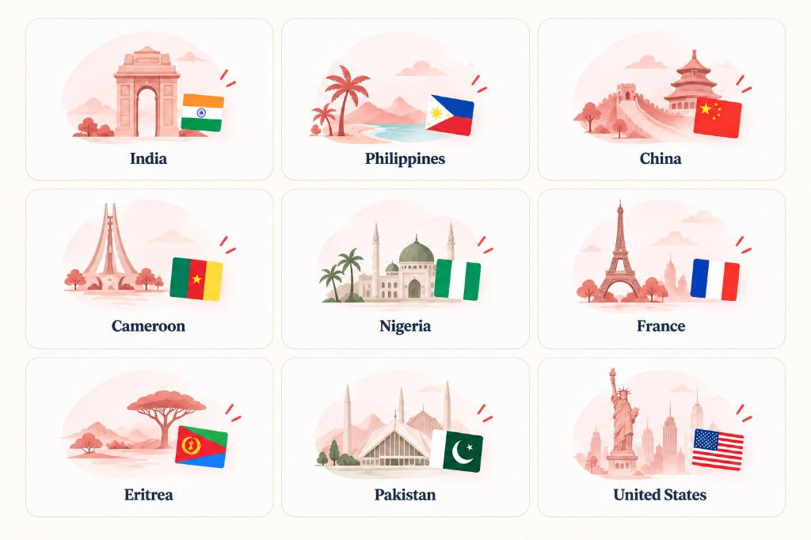

# Country guides

**Nav landing:** [https://docs.getnorthpath.com/#countries](https://docs.getnorthpath.com/#countries)

**Nav:** Countries

Document tips by source country (for example PCC, translations, local certificates). Each page links into File Checker and related tools. Not a substitute for country-specific embassy or IRCC instructions.

### 🌍 Countries we cover

Country guides on [docs.getnorthpath.com](https://docs.getnorthpath.com):

| Countries |
| :---: |
|  |

---

## Country pages on this site

| Country | URL | Typical focus (from site copy) |
| --- | --- | --- |
| India | [/from/india](https://docs.getnorthpath.com/from/india) | PCC, ECA, name-mismatch affidavits |
| Philippines | [/from/philippines](https://docs.getnorthpath.com/from/philippines) | PSA, NBI, CENOMAR |
| China | [/from/china](https://docs.getnorthpath.com/from/china) | Notarized translations, hukou |
| Cameroon | [/from/cameroon](https://docs.getnorthpath.com/from/cameroon) | Francophone Express Entry, TEF/TCF |
| Nigeria | [/from/nigeria](https://docs.getnorthpath.com/from/nigeria) | WAEC/NECO, proof of funds |
| France | [/from/france](https://docs.getnorthpath.com/from/france) | IEC / working-holiday timelines |
| Eritrea | [/from/eritrea](https://docs.getnorthpath.com/from/eritrea) | Family sponsorship, document-access affidavits |
| Pakistan | [/from/pakistan](https://docs.getnorthpath.com/from/pakistan) | NADRA, PCC, FRC |
| Ukraine | [/from/ukraine](https://docs.getnorthpath.com/from/ukraine) | Permit extensions, family sponsorship |
| United States | [/from/usa](https://docs.getnorthpath.com/from/usa) | FBI background check, cross-border moves |

---

## Related

- [IRCC File Checker](https://docs.getnorthpath.com/ircc-file-checker)
- [CHECKLISTS.md](CHECKLISTS.md)

**Official source:** [IRCC on canada.ca](https://www.canada.ca/en/services/immigration-citizenship.html)
