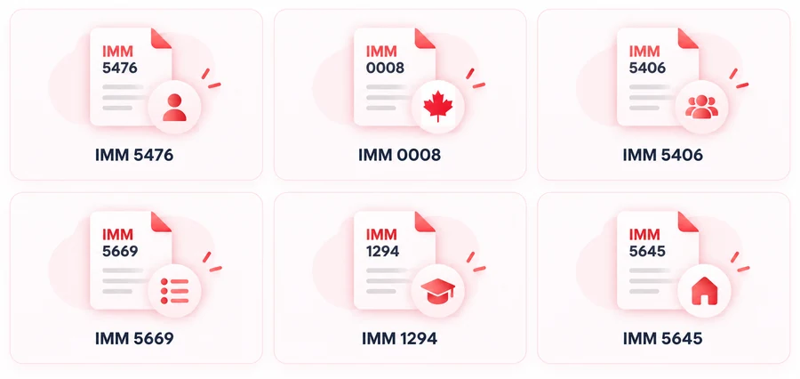

# IMM forms

**Nav landing:** [https://docs.getnorthpath.com/#forms](https://docs.getnorthpath.com/#forms)

**Nav:** IMM Forms

Hub pages for common IMM forms: what each form is for, how to prepare it, and which tools to use next (flatten, sign, file checker). Always download the **current** form from IRCC.

### 📋 Forms we provide

IMM form hubs on [docs.getnorthpath.com](https://docs.getnorthpath.com):

| Forms |
| :---: |
|  |

---

## Form pages on this site

| Form | Live page | Official IRCC page |
| --- | --- | --- |
| IMM 5476 | [/forms/imm-5476](https://docs.getnorthpath.com/forms/imm-5476) | [canada.ca IMM 5476](https://www.canada.ca/en/immigration-refugees-citizenship/services/application/application-forms-guides/imm5476.html) |
| IMM 0008 | [/forms/imm-0008](https://docs.getnorthpath.com/forms/imm-0008) | [canada.ca IMM 0008](https://www.canada.ca/en/immigration-refugees-citizenship/services/application/application-forms-guides/imm0008.html) |
| IMM 5406 | [/forms/imm-5406](https://docs.getnorthpath.com/forms/imm-5406) | [canada.ca IMM 5406](https://www.canada.ca/en/immigration-refugees-citizenship/services/application/application-forms-guides/imm5406.html) |
| IMM 5669 | [/forms/imm-5669](https://docs.getnorthpath.com/forms/imm-5669) | [canada.ca IMM 5669](https://www.canada.ca/en/immigration-refugees-citizenship/services/application/application-forms-guides/imm5669.html) |
| IMM 1294 | [/forms/imm-1294](https://docs.getnorthpath.com/forms/imm-1294) | [canada.ca IMM 1294](https://www.canada.ca/en/immigration-refugees-citizenship/services/application/application-forms-guides/imm1294.html) |
| IMM 5645 | [/forms/imm-5645](https://docs.getnorthpath.com/forms/imm-5645) | [canada.ca IMM 5645](https://www.canada.ca/en/immigration-refugees-citizenship/services/application/application-forms-guides/imm5645.html) |

---

## Typical prep order

1. Download the current form from canada.ca
2. Complete and validate as instructed
3. [Flatten IMM Form](https://docs.getnorthpath.com/flatten-imm-form) if you need to merge
4. [IRCC File Checker](https://docs.getnorthpath.com/ircc-file-checker) before upload

See [WORKFLOW.md](../WORKFLOW.md).

**Official source:** [Application forms and guides](https://www.canada.ca/en/immigration-refugees-citizenship/services/application/application-forms-guides.html)
