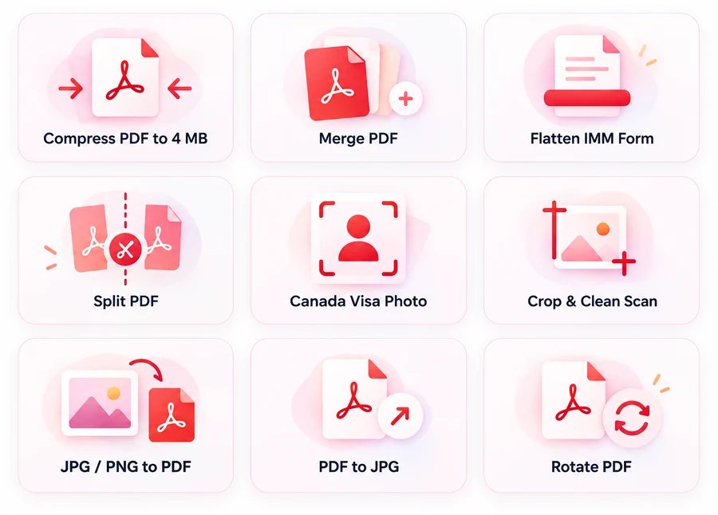
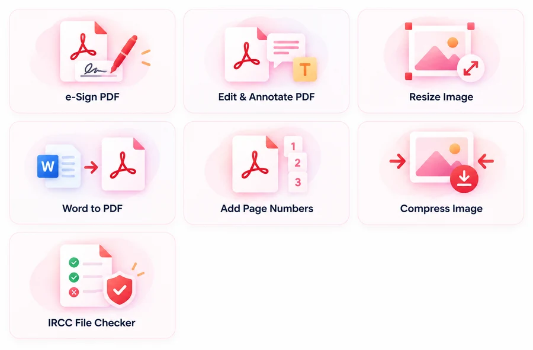

# Tools

**Nav landing:** [https://docs.getnorthpath.com/#tools](https://docs.getnorthpath.com/#tools)

**Nav:** Tools

Each tool is its own free page. Processing runs in the browser. Application files are not uploaded to a GetNorthPath server for compress, merge, flatten, or check.

Full toolkit: [https://docs.getnorthpath.com/northpath-docs-app](https://docs.getnorthpath.com/northpath-docs-app)

### 🧰 Tools we provide

Free in-browser tools on [docs.getnorthpath.com](https://docs.getnorthpath.com):

| Core PDF & photo | Sign, edit, convert & check |
| --- | --- |
|  |  |

---

## Live tools on this site

| Tool | URL | What it does |
| --- | --- | --- |
| Compress PDF to 4 MB | […/compress-pdf-to-4mb](https://docs.getnorthpath.com/compress-pdf-to-4mb) | Hit IRCC size limits (4 / 2 / 1 MB presets) |
| Merge PDF | […/merge-pdf](https://docs.getnorthpath.com/merge-pdf) | One file per checklist slot |
| Flatten IMM Form | […/flatten-imm-form](https://docs.getnorthpath.com/flatten-imm-form) | Fix “won’t merge” / Please wait |
| Split PDF | […/split-pdf](https://docs.getnorthpath.com/split-pdf) | Thumbnails or page range |
| Canada Visa Photo | […/canada-visa-photo](https://docs.getnorthpath.com/canada-visa-photo) | 35×45 mm crop |
| Crop & Clean Scan | […/crop-scan](https://docs.getnorthpath.com/crop-scan) | Shadows then crop |
| JPG / PNG to PDF | […/jpg-to-pdf](https://docs.getnorthpath.com/jpg-to-pdf) | Images to PDF, optional 4 MB |
| PDF to JPG | […/pdf-to-jpg](https://docs.getnorthpath.com/pdf-to-jpg) | Export every page |
| Rotate PDF | […/rotate-pdf](https://docs.getnorthpath.com/rotate-pdf) | Fix sideways scans |
| e-Sign PDF | […/sign-pdf](https://docs.getnorthpath.com/sign-pdf) | Draw, type, or upload a signature |
| Edit & Annotate PDF | […/edit-pdf](https://docs.getnorthpath.com/edit-pdf) | Stamp a note or date |
| Resize Image | […/resize-image](https://docs.getnorthpath.com/resize-image) | Exact pixels |
| Add Page Numbers | […/add-page-numbers](https://docs.getnorthpath.com/add-page-numbers) | Number merged binders |
| Compress Image | […/compress-image](https://docs.getnorthpath.com/compress-image) | Shrink JPG/PNG |
| IRCC File Checker | […/ircc-file-checker](https://docs.getnorthpath.com/ircc-file-checker) | Pass/fail before upload |

**Coming soon:** Word to PDF (`/word-to-pdf`) is not live.

---

## Related

- Sequences: [WORKFLOW.md](../WORKFLOW.md)
- Upload constraints: [RULES.md](../RULES.md)
- Inventory: [FEATURES.md](../FEATURES.md)

**Official source:** [IRCC on canada.ca](https://www.canada.ca/en/services/immigration-citizenship.html)
